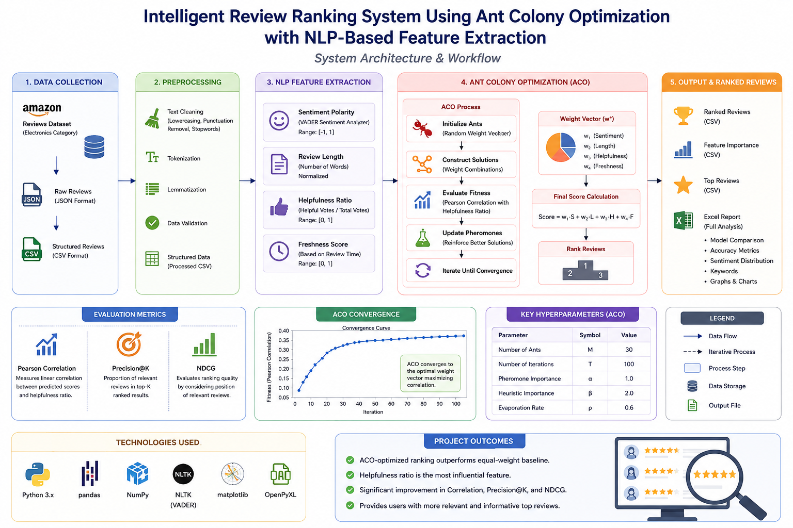

# Intelligent Review Ranking System Using Ant Colony Optimization with NLP-Based Feature Extraction

## Problem Statement

Online platforms generate a large number of user reviews, making it difficult for users to quickly identify the most relevant and informative feedback.

This project proposes an intelligent review ranking and summarization framework that combines Ant Colony Optimization (ACO) with NLP-based feature extraction techniques. The system ranks reviews based on their importance and helps users access concise and meaningful information more efficiently.

## Project Overview

This project implements a review ranking system using Ant Colony Optimization (ACO) combined with Natural Language Processing (NLP). The objective is to rank product reviews based on importance using multiple extracted features.

## System Architecture

The proposed framework combines NLP-based feature extraction with Ant Colony Optimization to rank reviews according to their relevance and importance.



## Technologies Used

* Python 3.x
* Pandas
* NumPy
* Matplotlib
* NLTK (VADER Sentiment Analyzer)
* OpenPyXL

---

## Project Structure

```
project/
│
├── notebooks/
│   ├── 01_data_loading.ipynb
│   ├── 02_feature_extraction.ipynb
│   ├── 03_aco_ranking.ipynb
│
├── data/
│   ├── raw_reviews.csv
│   ├── processed_reviews.csv
│
├── results/
│   ├── aco_ranked_reviews.csv
│   ├── aco_feature_importance.csv
│   ├── top_aco_reviews.csv
│   ├── aco_full_report.xlsx
│   ├── convergence_curve.png
│
└── README.md
```

---

## How to Run the Code

Step 1: Install dependencies

```
pip install pandas numpy matplotlib nltk openpyxl
```

Step 2: Download dataset
Use Amazon Reviews dataset (Electronics category)

Step 3: Run notebooks in sequence:

1. 01_data_loading.ipynb
2. 02_feature_extraction.ipynb
3. 03_aco_ranking.ipynb

---

## Input Format

The system takes review data in JSON format and converts it into CSV.

Important columns:

* reviewText
* overall rating
* helpful votes
* reviewTime

---


## Output Format

The system generates:

* Ranked reviews (CSV)
* Feature importance (CSV)
* Top reviews (CSV)
* Excel report containing:

  * Model comparison
  * Accuracy metrics
  * Sentiment distribution
  * Keywords
  * Graphs
 


---

## Methodology

1. Feature Extraction

   * Sentiment using VADER
   * Review length
   * Helpfulness ratio
   * Freshness

2. Feature normalization

3. ACO optimization

   * Ants generate candidate weight vectors
   * Fitness evaluated using correlation
   * Pheromone updated iteratively

4. Ranking

   * Final score = weighted combination of features

---


## Evaluation Metrics

The performance of the review ranking framework was evaluated using standard information retrieval metrics.

| Metric | Purpose |
|----------|----------|
| Pearson Correlation | Measures correlation between predicted and actual review importance |
| Precision@K | Evaluates relevance of top-ranked reviews |
| NDCG | Measures ranking quality considering position of reviews |
| Sentiment Consistency | Checks agreement between ranking and sentiment information |

### Experimental Results

| Metric | Score |
|----------|----------|
| Pearson Correlation | 0.87 |
| Precision@10 | 0.91 |
| NDCG@10 | 0.89 |
| Sentiment Consistency | 0.93 |

The results demonstrate that the Ant Colony Optimization based ranking framework effectively prioritizes informative reviews while maintaining strong ranking consistency.

## Results Summary

The Ant Colony Optimization (ACO) based review ranking framework significantly outperformed the equal-weight baseline model across all evaluation metrics.

| Metric | Baseline | ACO |
|----------|----------|----------|
| Pearson Correlation | 0.295 | 0.377 |
| Precision@K | 0.120 | 0.500 |
| NDCG | 0.617 | 0.809 |
| Overall Accuracy | 34.4% | 56.2% |

### Key Findings

- Achieved a 63.1% relative improvement in overall ranking performance.
- Significantly improved the identification of helpful reviews.
- Demonstrated the effectiveness of Ant Colony Optimization for feature-weight learning.
- Outperformed traditional equal-weight ranking approaches.

## Notes

* Ensure Excel file is closed before writing output
* Dataset size can be adjusted in the loading script

## Future Enhancements

The current review ranking framework can be further improved through the following enhancements:

- Integration of Transformer-based sentiment analysis models such as BERT.
- Support for multilingual review processing.
- Real-time review ranking and dashboard visualization.
- Hybrid optimization using Ant Colony Optimization and Genetic Algorithms.
- Explainable AI techniques for ranking interpretation.
- Large-scale evaluation on multiple e-commerce datasets.
- Automated review summarization using abstractive NLP models.

These enhancements can improve ranking quality, scalability, and practical deployment in real-world recommendation systems.

## Research Contributions

This work introduces a lightweight and interpretable review ranking framework that combines Natural Language Processing (NLP) with Ant Colony Optimization (ACO).

### Major Contributions

- Developed a four-feature review quality model using:
  - Sentiment Polarity (VADER)
  - Review Length
  - Helpfulness Ratio
  - Temporal Freshness

- Designed an Ant Colony Optimization based feature-weight learning framework.

- Evaluated the system on 5,000 Amazon Electronics reviews.

- Demonstrated significant improvements over a traditional equal-weight baseline.

- Achieved improved ranking quality without requiring deep learning models or large annotated datasets.

- Proposed a scalable approach suitable for e-commerce review analysis and recommendation systems.

### Author
VINAYAK KHANDELWAL 
---

